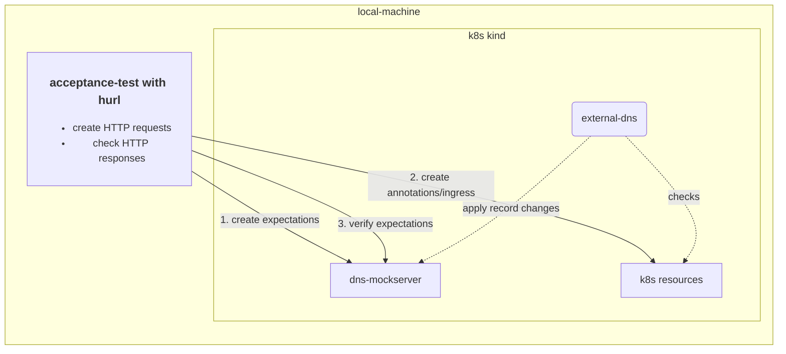

# ExternalDNS - IONOS Plugin

**⚠️ NOTE**: This Plugin is based on a not yet released version of
[ExternalDNS](https://github.com/kubernetes-sigs/external-dns) -
especially the new integration approach by using plugins, discussed and implemented in
[PR-3063](https://github.com/kubernetes-sigs/external-dns/pull/3063).

ExternalDNS is a Kubernetes add-on for automatically managing
Domain Name System (DNS) records for Kubernetes services by using different DNS providers.
By default, Kubernetes manages DNS records internally,
but ExternalDNS takes this functionality a step further by delegating the management of DNS records to an external DNS
provider such as IONOS.
Therefore, the IONOS plugin allows to manage your
IONOS domains inside your kubernetes cluster with [ExternalDNS](https://github.com/kubernetes-sigs/external-dns).

To use ExternalDNS with IONOS, you need your IONOS API key or token of the account managing
your domains.
For detailed technical instructions on how the IONOS plugin is deployed using the Bitnami Helm charts for ExternalDNS,
see[deployment instructions](#kubernetes-deployment).

## Kubernetes Deployment

The IONOS plugin is provided as a regular Open Container Initiative (OCI) image released in
the [GitHub container registry](https://github.com/ionos-cloud/external-dns-ionos-plugin/pkgs/container/external-dns-ionos-plugin).
The deployment can be performed in every way Kubernetes supports.
The following example shows the deployment as
a [sidecar container](https://kubernetes.io/docs/concepts/workloads/pods/#workload-resources-for-managing-pods) in the
ExternalDNS pod
using the [Bitnami Helm charts for ExternalDNS](https://github.com/bitnami/charts/tree/main/bitnami/external-dns).

```shell
helm repo add bitnami https://charts.bitnami.com/bitnami
kubectl create secret generic ionos-credentials --from-literal=api-key='<EXAMPLE_PLEASE_REPLACE>'

# create the helm values file
cat <<EOF > external-dns-ionos-values.yaml
image:
  registry: ghcr.io
  repository: ionos-cloud/external-dns-plugin-provider
  tag: latest

provider: plugin

extraArgs:
  plugin-provider-url: http://localhost:8888

sidecars:
  - name: ionos-plugin
    image: ghcr.io/ionos-cloud/external-dns-ionos-plugin:$RELEASE_VERSION
    ports:
      - containerPort: 8888
        name: http
    livenessProbe:
      httpGet:
        path: /health
        port: http
      initialDelaySeconds: 10
      timeoutSeconds: 5
    readinessProbe:
      httpGet:
        path: /health
        port: http
      initialDelaySeconds: 10
      timeoutSeconds: 5
    env:
      - name: LOG_LEVEL
        value: debug
      - name: IONOS_API_KEY
        valueFrom:
          secretKeyRef:
            name: ionos-credentials
            key: api-key
      - name: SERVER_HOST
        value: "" 
      - name: IONOS_DEBUG
        value: "true"  
EOF
# install external-dns with helm
helm install external-dns-ionos bitnami/external-dns -f external-dns-ionos-values.yaml
```

## Verify the image resource integrity

All official plugins provided by IONOS are signed using [Cosign](https://docs.sigstore.dev/cosign/overview/).
The Cosign public key can be found in the [cosign.pub](./cosign.pub) file.

Note: Due to the early development stage of the plugin, the image is not yet signed
by [sigstores transparency log](https://github.com/sigstore/rekor).

```shell
export RELEASE_VERSION=latest
cosign verify --insecure-ignore-tlog --key cosign.pub ghcr.io/ionos-cloud/external-dns-ionos-plugin:$RELEASE_VERSION
```

## Development

The basic development tasks are provided by make. Run `make help` to see the available targets.

### Local deployment

The plugin can be deployed locally with a kind cluster. As a prerequisite, you need to install:

- [Docker](https://docs.docker.com/get-docker/),
- [Helm](https://https://helm.sh/ ) with the repos:

 ```shell
  helm repo add bitnami https://charts.bitnami.com/bitnami
  helm repo add mockserver https://www.mock-server.com
  helm repo update
  ```

- [kind](https://kind.sigs.k8s.io/docs/user/quick-start/)
- [kubectl](https://kubernetes.io/docs/tasks/tools/)

```shell
# setup the kind cluster and deploy external-dns with ionos plugin and a dns mockserver
./scripts/deploy_on_kind.sh

# check if the plugin is running
kubectl get pods -l app.kubernetes.io/name=external-dns -o wide

# trigger a DNS change e.g. with annotating the ingress controller service
kubectl -n ingress-nginx annotate service  ingress-nginx-controller "external-dns.alpha.kubernetes.io/internal-hostname=nginx.internal.example.org." 
 
# cleanup
./scripts/deploy_on_kind.sh clean
```

### Local acceptance tests

The acceptance tests are run against a kind cluster with ExternalDNS and the plugin deployed.
The DNS mock server is used to verify the DNS changes. The following diagram shows the test setup:



For running the acceptance tests locally you need to install [hurl](https://hurl.dev/).
To check the test run execution, see the [Hurl files](./test/hurl).
To view the test reports, see the `./build/reports/hurl` directory.

```shell
scripts/acceptance-tests.sh 
```
